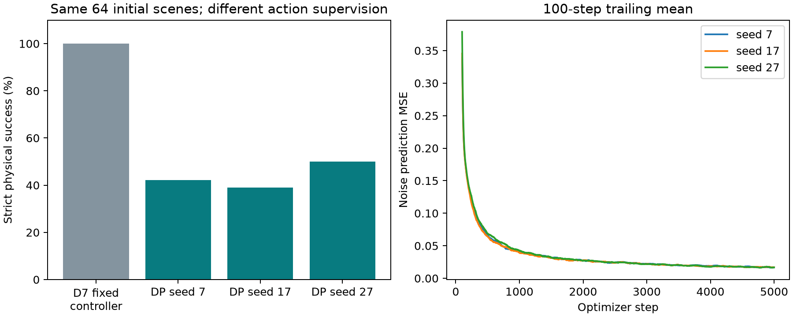

# Diffusion Policy：独立追加实验

## 方法与输入边界

DP-D 使用已有 D_seed7 模型从初始 RGB 估计方块 XY，冻结该视觉模块。条件包括该初始估计、机器人末端位置、夹爪宽度、上一动作和运行时钟。策略学习 16 步末端 XYZ＋夹爪命令，每次执行前 8 步后重新读取机器人状态预测。部署没有调用原来的抓取阶段状态机，真值只参与评分。

这是参考 Diffusion Policy 条件动作扩散思想的紧凑实现：FiLM 时序 U-Net、100 步余弦噪声训练、20 步确定性 DDIM、最终 EMA 权重。不是官方全部配置的复刻，也不是端到端多帧 RGB 策略。

新增 128 条训练和 16 条验证仿真专家轨迹（均实际成功），每条 320 个控制步。专家使用仿真真实初始位置生成动作；个人视频只用于上游视觉预训练，没有从手部关键点伪造机器人动作。三个策略种子各固定训练 5,000 步。

## 实际物理评测

| 策略 | 严格成功 | 合格抬升 | 验证动作 XYZ 误差 mm |
|---|---:|---:|---:|
| 原 D7＋固定控制器（既有参照） | 64/64 | — | — |
| DP 种子 7 | 27/64 | 33/64 | 12.700 |
| DP 种子 17 | 25/64 | 30/64 | 12.454 |
| DP 种子 27 | 32/64 | 39/64 | 11.980 |

合计 84/192，成功率 43.75%。192 次执行重复使用 64 个场景；三个策略种子使用同一个视觉模型。没有选择最好检查点、种子或测试子集。



## 如何解读

DP 每回合固定执行 12.8 秒，原固定控制器在完成阶段后结束（具体时长范围见 results.json），执行时长也不相同。与原方法的控制器及动作监督不同；不能把成功率差异归因于辅助标签或扩散算法本身。固定控制器针对这个简单任务已经非常有效。仅离线动作误差或训练损失较低不保证闭环抓取成功；偏差可能在连续执行中累积。

数据与输入审计 847 项通过。初始测试图像与 D7 参照逐场景完全一致。跨集合完全相同的渲染图像数量：{'train_val': 0, 'train_test': 1, 'val_test': 1}；独立 scene seed 不保证像素唯一。

## 相同初始图像的追加敏感性检查

训练/验证与测试存在相同像素的初始图像；对应测试场景为 [30013, 30032]。它们使用不同的 scene seed，但不属于视觉独立样本。主表保留所有预定场景，没有根据结果删除。额外排除这些初始图像后，各种子成功数/次数：[{'seed': 7, 'n': 62, 'successes': 25}, {'seed': 17, 'n': 62, 'successes': 24}, {'seed': 27, 'n': 62, 'successes': 31}]。这只是事后描述性核查。

## 证据和复现

[固定方案](../../../configs/diffusion_policy.json) · [完整指标](results.json) · [审计](audit.json) · [逐回合记录](episodes.jsonl)

采集/训练入口保护已有数据与模型，不能直接覆盖重跑。评测仅在模型、配置、源代码一致时续跑尚未完成的场景。报告可从完整工件重新生成。

```powershell
. .\scripts\Enter-Project.ps1
.\.env\python.exe scripts\analyze_diffusion_policy.py
```

实现入口：scripts/collect_diffusion_demonstrations.py、train_diffusion_policy.py、evaluate_diffusion_policy.py。原 A/B/C/D/R 与世界模型工件保持不变。

[方法来源：Diffusion Policy](https://diffusion-policy.cs.columbia.edu/) · [官方实现](https://github.com/real-stanford/diffusion_policy)

## 失败分解

| 策略种子 | 未合格抬升 | 抬升后仍失败 |
|---|---:|---:|
| 7 | 31 | 6 |
| 17 | 34 | 5 |
| 27 | 25 | 7 |

终态各失败标志为非互斥计数，见 results.json；例如未完全越线、物体翻倒可能同时发生。首次失败回放从已保存动作重放，不再次抽样扩散动作，也不增加独立评测样本。

[失败回放核对](failure_review/summary.json)
