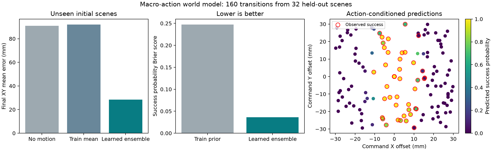
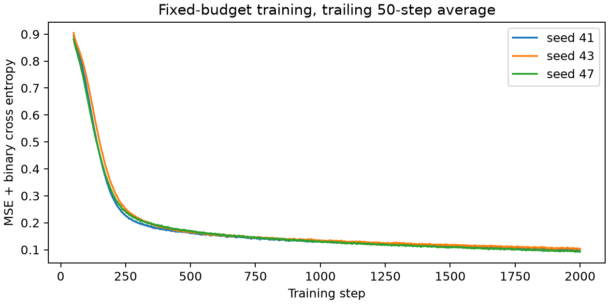

# 抓取宏动作世界模型：独立扩展

该模型学习一次完整抓取技能的状态转移和事件概率。输入是执行前的物体 XY 与下发抓取 XY，输出最终 XY 位移、合格抬升概率和严格任务成功概率。它不生成视频，也不替代物理引擎。

已冻结的数据为 64 个训练场景×5动作、16 个验证场景×5动作、32 个测试场景×5动作，共 560 次物理执行。每场景一个零偏移和四个预先随机确定的偏移；真实位移不作为动作标签。划分按完整初始场景，未根据结果调参。

训练和以下预测质量评估采用仿真真实初始 XY；部署接口只接收外部估计值。个人手机视频没有提供这些物理转移标签，它通过独立视觉模型参与后续 RGB 集成演示。

| 预测器 | 最终 XY 平均误差 / mm | 成功概率 Brier | 成功准确率（阈值0.5） |
|---|---:|---:|---:|
| 不发生位移 | 90.885 | 0.2475 | 55.62% |
| 训练集平均位移 | 92.062 | 0.2475 | 55.62% |
| 三种子学习模型平均 | 28.411 | 0.0365 | 95.62% |

基线分类概率统一采用训练集事件频率；不使用测试标签估计常数。Brier 越小越好，分类准确率也可能受类别比例影响。

## 每个固定训练种子

| 种子 | 最终 XY 平均误差 / mm | 成功概率 Brier |
|---|---:|---:|
| 41 | 29.827 | 0.0373 |
| 43 | 31.630 | 0.0374 |
| 47 | 28.331 | 0.0363 |

## 解释边界

- 三个种子全部使用最终固定步数检查点，ensemble 是预先约定的等权平均，没有挑选最好模型。
- 160 条测试转移只来自 32 个初始场景；同场景五个动作相关，不按160个独立环境计算置信区间。
- 场景物体、目标、技能、摩擦和质量固定。没有验证新物体、目标变化、长时序滚动或视频生成。
- 使用真实状态的预测误差不能等同于 RGB 感知不确定条件下的预测误差；集成演示单独记录。
- 这个扩展不修改前面 A/B/C/D/R 的1,920次模型控制结果，也不证明世界模型提高了策略成功率。
- NumPy 导出与 Torch 的最大位移差为 2.98e-08 m，最大概率差 1.19e-07。

[完整指标、配置与来源](results.json)
