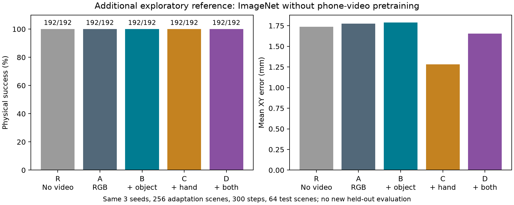

# 额外诊断：不做真实视频预训练

R 直接从 ImageNet ResNet18 初始化，跳过手机视频预训练；仿真适配图像、XY 标签、300 步预算、新头初始化、batch 与增强顺序、物理控制器均与对应种子配对。

这项诊断在部分主实验定位指标已可见后追加，使用相同开发测试场景；不是新的未触碰验证。原定四组主结果保持原样。

R：192/192，成功率 100.00%，平均 XY 误差 1.735 mm。

| 比较 | 成功率差 / 百分点 | 平均误差差 / mm |
|---|---:|---:|
| A-R | +0.00 | +0.038 |
| B-R | +0.00 | +0.055 |
| C-R | +0.00 | -0.453 |
| D-R | +0.00 | -0.082 |

误差差为负代表定位误差更小。仅 3 个训练种子、单一真实场景族与固定仿真外观，不能据此推广到真实机器人或其他任务。并行运行过部分训练进程，因此训练耗时仅作来源记录，不作严格速度比较。

三个训练种子复用同一批 64 个仿真场景；192 次执行不是 192 个独立环境。成功率饱和只能说明当前样本中未观察到差异，不能证明方法等效。

来源与配对核对 96/96 项通过，包括初始化检查点、训练代码、完成状态及逐回合组别／种子／场景身份。审计只覆盖已记录的来源字段，不构成统计泛化证明。

[原始数字与公平性核对](imagenet_reference.json)
