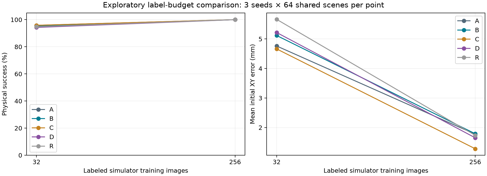

# 32 张仿真适配图像的追加实验

该实验在观察到 256 图像参照的成功率饱和后固定，只运行一次预设预算。训练场景按索引取 10000–10031，不按结果筛选。验证与测试场景复用，因此这是探索性追加分析，不是新的未见测试。

五组使用相同 32 张图像、相同 300 步和 batch 16；A/B/C/D 复用已完成的真实视频编码器，R 直接从 ImageNet 开始。保持相同步数意味着样本重复次数增加，不能说成计算预算按数据量下降。

全部训练种子复用同一个固定 32 图像子集，没有重复抽取其他 32 图像子集。不同种子只覆盖训练随机性，因此不能据此宣称普遍的样本效率优势。

| 组别 | 32 张：成功次数 | 32 张：平均误差 mm | 256 张：成功次数 | 256 张：平均误差 mm |
|---|---:|---:|---:|---:|
| A | 184/192 | 4.761 | 192/192 | 1.774 |
| B | 183/192 | 5.117 | 192/192 | 1.790 |
| C | 184/192 | 4.662 | 192/192 | 1.282 |
| D | 181/192 | 5.217 | 192/192 | 1.654 |
| R | 182/192 | 5.663 | 192/192 | 1.735 |

## 逐种子差异

| 比较 | 平均差 / 百分点 | seed 7 | seed 17 | seed 27 |
|---|---:|---:|---:|---:|
| D-A | -1.56 | +0.00 | -1.56 | -3.12 |
| D-B | -1.04 | -1.56 | +1.56 | -3.12 |
| D-C | -1.56 | +0.00 | -1.56 | -3.12 |
| A-R | +1.04 | +0.00 | +1.56 | +1.56 |
| D-R | -0.52 | +0.00 | +0.00 | -1.56 |

## 失败在共同场景中的分布

46 次失败执行集中在 6 个共同场景中；总共只有 64 个不同测试场景，每个场景由 5 组 × 3 个训练种子重复执行。192 次组内执行不是 192 个独立环境。

| 场景种子 | 失败执行次数 | 该场景总执行次数 |
|---|---:|---:|
| 30014 | 9 | 15 |
| 30031 | 1 | 15 |
| 30038 | 15 | 15 |
| 30044 | 3 | 15 |
| 30054 | 3 | 15 |
| 30056 | 15 | 15 |

在全部组别与训练种子中都失败的场景：30038、30056。

来源与配对核对 422/422 项通过，包括固定子集与原数据逐数组一致性、初始化检查点、训练代码、完成状态及逐回合身份。

三个训练种子、同一真实开发场景族、固定相机仿真分布；不据此断言显著性或真实机器人泛化。包括 R 在内共 960 次追加物理仿真执行。审计只覆盖已记录的来源字段，不构成统计泛化证明；见 [low32_results.json](low32_results.json)。
