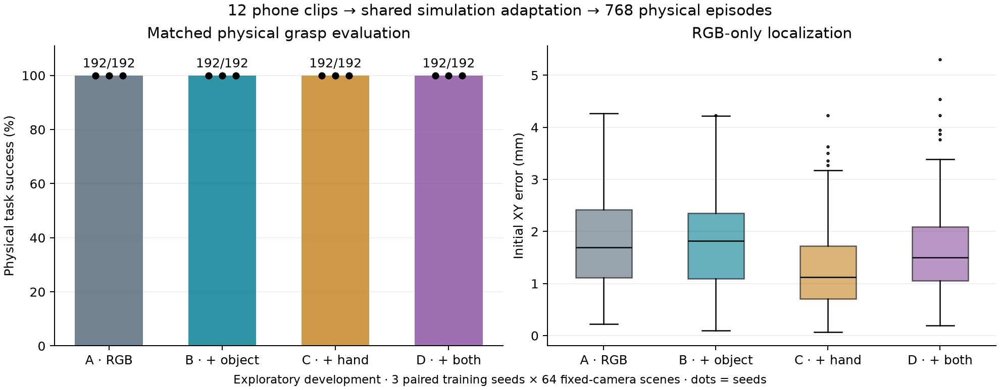
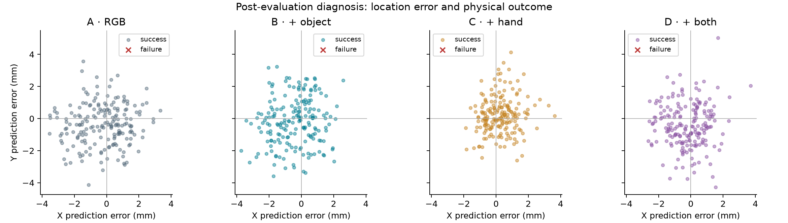
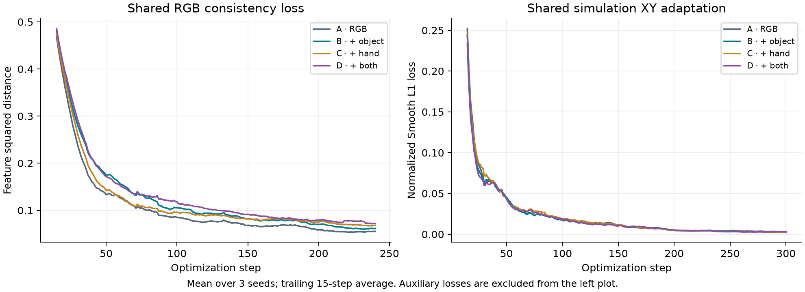

# 四组视觉辅助监督：探索性开发实验

固定 3 个训练种子 × 每组 64 个相同场景，共 768 次真实物理仿真执行。下列数值来自逐回合日志，不是计划值或 oracle 结果。

| 组别 | 成功次数 | 成功率 | XY 平均误差 / mm | XY P90 / mm |
|---|---:|---:|---:|---:|
| A | 192/192 | 100.00% | 1.774 | 3.076 |
| B | 192/192 | 100.00% | 1.790 | 2.831 |
| C | 192/192 | 100.00% | 1.282 | 2.427 |
| D | 192/192 | 100.00% | 1.654 | 2.766 |

A：共同 RGB 基础训练；B：加物体监督；C：加手关键点监督；D：两者都有。所有组均接受相同仿真 XY 标签适配。

## 配对差异

| 比较 | 差值 / 百分点 | seed 7 | seed 17 | seed 27 | 描述性 95% 区间 / 百分点 |
|---|---:|---:|---:|---:|---|
| D-A | +0.00 | +0.00 | +0.00 | +0.00 | [+0.00, +0.00] |
| D-B | +0.00 | +0.00 | +0.00 | +0.00 | [+0.00, +0.00] |
| D-C | +0.00 | +0.00 | +0.00 | +0.00 | [+0.00, +0.00] |
| B-A | +0.00 | +0.00 | +0.00 | +0.00 | [+0.00, +0.00] |
| C-A | +0.00 | +0.00 | +0.00 | +0.00 | [+0.00, +0.00] |

区间通过分别重采样训练种子和共同场景、保持组间配对计算（10,000 次）。只有 3 个训练种子，区间仅用于描述；不能据此声称稳定的人群泛化或显著性。帧没有被当作独立回合。全部观测差异为零时，bootstrap 会退化成 [0,0]；这不代表总体不确定性为零，也不是等效性证明。

## 每个训练种子

| 组别 | 训练种子 | 成功次数 | 定位平均误差 / mm |
|---|---:|---:|---:|
| A | 7 | 64/64 | 1.458 |
| B | 7 | 64/64 | 1.528 |
| C | 7 | 64/64 | 1.479 |
| D | 7 | 64/64 | 1.339 |
| A | 17 | 64/64 | 2.048 |
| B | 17 | 64/64 | 1.989 |
| C | 17 | 64/64 | 1.163 |
| D | 17 | 64/64 | 1.758 |
| A | 27 | 64/64 | 1.815 |
| B | 27 | 64/64 | 1.853 |
| C | 27 | 64/64 | 1.204 |
| D | 27 | 64/64 | 1.864 |

## 失败与训练曲线

失败标记可同时出现，不能把它们相加当作失败回合数。

- A：{}
- B：{}
- C：{}
- D：{}

## 数据与证据边界

- 12 条本人手机视频，86.48 秒、2,162 帧；四组共同使用 438 张 5 Hz 完整 RGB。物体候选有效 398 张，手关键点输出 223 张。
- 视频视为同一保守开发场景族，没有真实未见场景测试。实际采集批次仍未知。
- 仿真适配 256 训练场景、64 验证场景；64 测试场景只改变初始位置，共用相机、背景、方块姿态和物理参数。
- 每组每种子预训练 240 步、适配 300 步、batch 16；使用最终检查点，没有据测试结果挑选。
- 控制器是固定物理抓取状态机，未实现 VLA、语言条件策略、世界模型或视频时序动作模仿。
- 原定四组本身不能回答真实视频相对不使用视频的收益；已另行追加 [ImageNet-only 参照](IMAGENET_REFERENCE_ZH.md)，复用相同开发测试场景，不能视为新的确认性证据。
- 伪标签候选覆盖率不等于定位准确率；稀疏目视检查不替代人工密集真值。
- 公平性与来源审计 2668/2668 项通过；见 [fairness_audit.json](fairness_audit.json)。

完整数字：[results.json](results.json)；所有回合：[episodes.jsonl](episodes.jsonl)。
